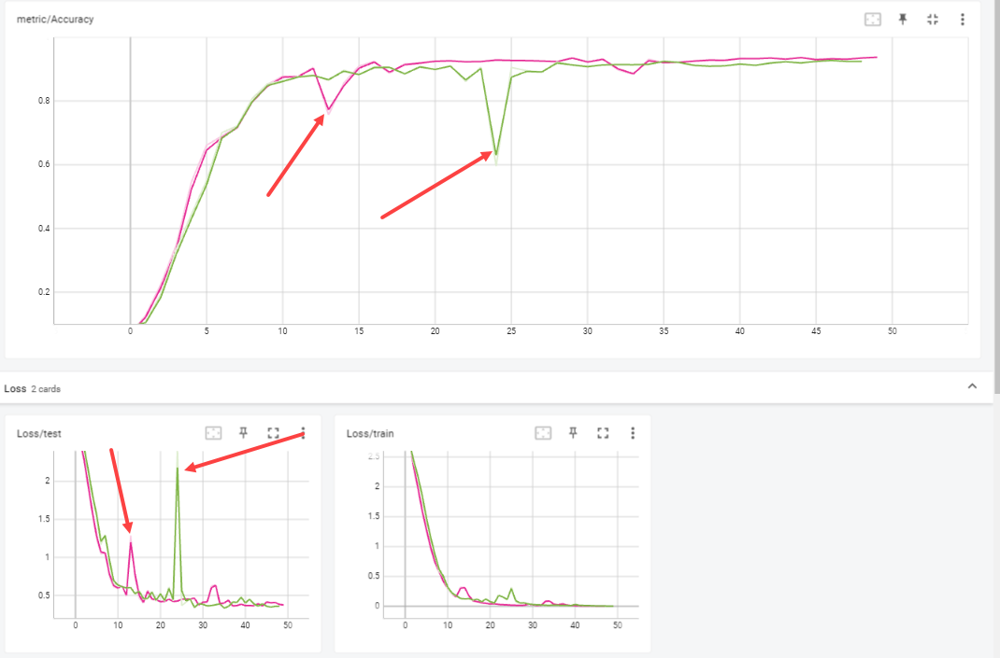

# Tentamen ML2022-2023

De opdracht is om de audio van 10 cijfers, uitgesproken door zowel mannen als vrouwen, te classificeren. De dataset bevat timeseries met een wisselende lengte.

In [references/documentation.html](references/documentation.html) lees je o.a. dat elke timestep 13 features heeft.
Jouw junior collega heeft een neuraal netwerk gebouwd, maar het lukt hem niet om de accuracy boven de 67% te krijgen. Aangezien jij de cursus Machine Learning bijna succesvol hebt afgerond hoopt hij dat jij een paar betere ideeen hebt.

## Vraag 1

### 1a
In `dev/scripts` vind je de file `01_model_design.py`.
Het model in deze file heeft in de eerste hidden layer 100 units, in de tweede layer 10 units, dit heeft jouw collega ergens op stack overflow gevonden en hij had gelezen dat dit een goed model zou zijn.
De dropout staat op 0.5, hij heeft in een blog gelezen dat dit de beste settings voor dropout zou zijn.

- Wat vind je van de architectuur die hij heeft uitgekozen (een Neuraal netwerk met drie Linear layers)? Wat zijn sterke en zwakke kanten van een model als dit in het algemeen? En voor dit specifieke probleem?
MM: Lagen verkleinen snel. Voor: Snel resultaat, eenvoudig te maken. Tegen: Niet het beste model voor een RNN probleem. Geen gates en geen geheugen.
- Wat vind je van de keuzes die hij heeft gemaakt in de LinearConfig voor het aantal units ten opzichte van de data? En van de dropout?
MM:

input: De input van dit model is 13 features. Python telt vanaf 0, dus dit moet 12 zijn.
h1: 100 hidden units is te hoog voor het aantal features. Hierdoor kan er overfitting ontstaan. Een vuistregel bij neurale netwerken is dat het aantal units niet meer dan twee keer zo groot is dan het aantal input units. In dit geval is het maximum dus 26. Door middel van trial en error kan het optimale aantal units gevonden worden. Je zou bijvoorbeeld kunnen werken met factoren (1,5x input en 2x de input) om het beste resultaat te vinden.
h2: Verkleint het model te veel naar 10 units. Het aantal units wordt lager dan het aantal klassen. Hierdoor kun je nooit meer een goed eindresultaat bereiken.
Output: staat op 20. Technisch gezien kan dit niet omdat de laag ervoor 13 nodes heeft. Een deel van de informatie in het model is dus al verdwenen. Het aantal klassen is wel juist. 10 getallen uitgesproken door een man of een vrouw
Dropout: Dropout is erg hoog. De helft van de data wordt weggegooid. Gezien het formaat van de dataset lijkt mij dit wat veel. Er zijn in totaal 8800 observaties over 10 getallen (880 per getal). Als je de helft weggooit heb je er dus maar 4400 over. Voor machine learning begrippen is dit in verhouding weinig.

## 1b
Als je in de forward methode van het Linear model kijkt (in `tentamen/model.py`) dan kun je zien dat het eerste dat hij doet `x.mean(dim=1)` is. 

- Wat is het effect hiervan? Welk probleem probeert hij hier op te lossen? (maw, wat gaat er fout als hij dit niet doet?)
MM: Een audio bestand is een bestand met 3 dimensies. Met x.mean rekent hij het gemiddelde uit over de tweede dimensie de batchsize. Door het gemiddelde te berekenen verminder je ruis die er ingevoerd wordt in de encoder. Daarnaast maak je het signaal duidelijker en wordt het model daardoor sneller. Het gemiddelde van deze tensor wordt vervolgens ingevoerd in de encoder. 

- Hoe had hij dit ook kunnen oplossen?
MM: Je kunt ook batchnormalisatie toepassen na de eerste laag om de data terug te brengen naar kleinere waarden.

- Wat zijn voor een nadelen van de verschillende manieren om deze stap te doen?
MM: Bij de methode van de junior is goed te zien om welke dimensie het gaat in het model. Het is ook foutgevoelig en 'hard coded'. Met batchnormalisatie gebeurt

### 1c
Omdat jij de cursus Machine Learning hebt gevolgd kun jij hem uitstekend uitleggen wat een betere architectuur zou zijn.

- Beschrijf de architecturen die je kunt overwegen voor een probleem als dit. Het is voldoende als je beschrijft welke layers in welke combinaties je zou kunnen gebruiken.
MM: Er zijn een aantal modellen geschikt voor dit type probleem. Je kunt een RNN gebruiken en varianten ervan (LTSM,GRU). Gezien de lengte van de audio bestanden zou een Gru goed passen. Door een attention laag toe te voegen can de accuracy wat verhoogd worden. Attention is een effectieve en efficiënte manier om meer context (weging) te geven aan de data.

Een CNN model zou ook kunnen passen met conv1d lagen. Ik zou dan beginnen met een model met 2 CNN lagen, Relu en een avgpool functie. Gezien de beperkte lengte van de dataset zijn twee lagen voldoende. Een model dat dieper gaat voegt gezien het aantal klassen (10) waarschijnlijk weinig toe. Daarnaast is het de vraag of een CNN in een dataset met slechts 8800 observaties voldoende data heeft om goed uit de verf te komen

- Geef vervolgens een indicatie en motivatie voor het aantal units/filters/kernelsize etc voor elke laag die je gebruikt, en hoe je omgaat met overgangen (bv van 3 naar 2 dimensies). Een indicatie is bijvoorbeeld een educated guess voor een aantal units, plus een boven en ondergrens voor het aantal units. Met een motivatie laat je zien dat jouw keuze niet een random selectie is, maar dat je 1) andere problemen hebt gezien en dit probleem daartegen kunt afzetten en 2) een besef hebt van de consquenties van het kiezen van een range.
MM: : ok zou ik kleine filters gebruiken (2x2) omdat de dataset klein is.

- Geef aan wat jij verwacht dat de meest veelbelovende architectuur is, en waarom (opnieuw, laat zien dat je niet random getallen noemt, of keuzes maakt, maar dat jij je keuze baseert op ervaring die je hebt opgedaan met andere problemen).

Een gru met attention is waarschijnlijk het meest geschikte model. Dit model is erg goed in het herkennen van patronen en het in de context plaatsen van text zonder dat dit excessief veel computerkracht vergt.

### 1d
Implementeer jouw veelbelovende model: 

- Maak in `model.py` een nieuw nn.Module met jouw architectuur : Concept laag geimplementeerd - RNN Gru model zonder attention layer.
- Maak in `settings.py` een nieuwe config voor jouw model:
MM: Het settings bestand is bijgewerkt met de settings voor het GRU Model.
- Train het model met enkele educated guesses van parameters. 
Gezien de grootte van de dataset heb ik ervoor gekozen om de dropout op 0 te zetten. Ik wil het model trainen op alle (beperkte) data die er is.
MM: Training 1: H1: 128, dropout: 0, num layers = 1. Accuracy: 0,938
MM: Training 2: H1: 128, dropout: 0, num layers = 2. Accuracy: 0.9421
MM: Training 3: H1: 64 , dropout: 0, num layers = 2. Accuracy: 0.9269
MM: Training 4: H1: 256, dropout: 0, num layers = 2. Accuracy: 0,9559

- Rapporteer je bevindingen. Ga hier niet te uitgebreid hypertunen (dat is vraag 2), maar rapporteer (met een afbeelding in `antwoorden/img` die je linkt naar jouw .md antwoord) voor bijvoorbeeld drie verschillende parametersets hoe de train/test loss curve verloopt.

De hoogste accuracy wordt behaald met een RNN netwerk met twee lagen en 256 hidden nodes. 

<figure>
  

    
    <figcaption align="center">
      <b> Fig 1. De performance van de vier modellen in Tensorboard</b>
    </figcaption>
  

</figure>

Het 3e model laat een sterke stijging in de test/loss functie zien rond epoch 24. Hierdoor daalt de accuracy sterk en herstelt zich later weer. Dit kan duiden op overfitting. Dit model heeft ook de laagste accuracy van de 4 configuraties die getest zijn. Uit deze korte verkenning zou je kunnen concluderen dat een hidden layer size van 64 te klein is.

Het eerste model laat ook duidelijk overfitting zien. rond Epoch 13. In dit model is maar 1 laag gebruikt. Hieruit concludeer ik dat 1 laag niet diep genoeg is voor het RNN netwerk om tot een goed model te komen.

<figure>
  

    
    <figcaption align="center">
      <b> Fig 2. Overfitting van model 1 en 3</b>
    </figcaption>
  

</figure>

Model 2 en 4 laten de beste resultaten zien. Er is geen geen sprake van overfitting en er wordt een hoge accuracy behaald. Model 4 presteert het beste omdat hier de hidden layer size is verdubbeld naar 256. Dit levert ongever 1% meer accuracy op.

- reflecteer op deze eerste verkenning van je model. Wat valt op, wat vind je interessant, wat had je niet verwacht, welk inzicht neem je mee naar de hypertuning.

Ik had niet verwacht dat 64 filters zo snel zou leiden tot overfitting. Ook had ik niet verwacht dat dit relatief simpele model zo goed zou presteren. Het is een standaard GRU die al als resultaat 95% behaalt. Best goed.

Hieronder een voorbeeld hoe je een plaatje met caption zou kunnen invoegen.

## Vraag 2
Een andere collega heeft alvast een hypertuning opgezet in `dev/scripts/02_tune.py`.

### 2a
Implementeer de hypertuning voor jouw architectuur:
- zorg dat je model geschikt is voor hypertuning - 

MM: Settings file aangepast voor hypertuning
ray tune.choice methode gebruikt om model te forceren om te kiezen tussen twee of drie lagen. Halve lagen kunnen niet.

- je mag je model nog wat aanpassen, als vraag 1d daar aanleiding toe geeft. Als je in 1d een ander model gebruikt dan hier, geef je model dan een andere naam zodat ik ze naast elkaar kan zien.
- Stel dat je
- voeg jouw model in op de juiste plek in de `tune.py` file.

RNN Gru model toegevoegd aan tune.py file

- maak een zoekruimte aan met behulp van pydantic (naar het voorbeeld van LinearSearchSpace), maar pas het aan voor jouw model.

MM: Zoekruimte voor RNNgru ingevoegd in de settings file (Grusearchspace).

- Licht je keuzes toe: wat hypertune je, en wat niet? Waarom? En in welke ranges zoek je, en waarom? Zie ook de [docs van ray over search space](https://docs.ray.io/en/latest/tune/api_docs/search_space.html#tune-sample-docs) en voor [rondom search algoritmes](https://docs.ray.io/en/latest/tune/api_docs/suggestion.html#bohb-tune-search-bohb-tunebohb) voor meer opties en voorbeelden.

In de verkennende fase is geconstateerd dat twee lagen een beter resultaat geeft dan 1 laag. In de hypertune file is de paramater 2 en 3 meegegeven om te meten of een 3e laag wat toevoegt.

We hebben ook gezien dat bij een laaggrootte van 64 het model gaat overfitten. Er is daarom voor gekozen om te hypertunen vanaf 128 tot en met 256 nodes in stappen van 64. Dit zorgt voor een betere performance van het hypertuning model en zorgt ervoor dat de zoekruimte stapsgewijs toeneemt.

De dropout was te hoog in het eerste model (0,5). Dit zorgt voor erg slechte performance doordat de helft van de data wordt weggegooid. De searchspace voor de dropout is in dit model afgesteld op tussen de 0 en 0.3.

### 2b
- Analyseer de resultaten van jouw hypertuning; visualiseer de parameters van jouw hypertuning en sla het resultaat van die visualisatie op in `reports/img`. Suggesties: `parallel_coordinates` kan handig zijn, maar een goed gekozen histogram of scatterplot met goede kleuren is in sommige situaties duidelijker! Denk aan x en y labels, een titel en units voor de assen.

MM: Afbeeldingen invoegen voor Hypertuning.

- reflecteer op de hypertuning. Wat werkt wel, wat werkt niet, wat vind je verrassend, wat zijn trade-offs die je ziet in de hypertuning, wat zijn afwegingen bij het kiezen van een uiteindelijke hyperparametersetting.

MM:In eerste instantie het hypertuning model de keuze gegeven tussen 2 of drie RNN lagen. Dit leidde tot dramatische performance (ruim 1,5 uur hypertunen) en heeft uiteindelijk de VM gecrasht (out of memory). 

Daarna de settings van de searchspace aangepast naar 2 lagen en de keuze gegeven om een kleine dropout (max 0,3) toe te passen. Met dit model een accuracy gehaald van 96,6%. met een kleine dropout van 0,19. 

De les hieruit in dit geval is dat meer niet altijd beter is. Het meer eenvoudige hypertuning model was in +-18 minuten klaar. Het andere hypertuning model heeft de eindstreep niet gehaald.

-Importeer de afbeeldingen in jouw antwoorden, reflecteer op je experiment, en geef een interpretatie en toelichting op wat je ziet.

MM: Hypertuning afbeeldingen invoegen.

### 2c
- Zorg dat jouw prijswinnende settings in een config komen te staan in `settings.py`, en train daarmee een model met een optimaal aantal epochs, daarvoor kun je `01_model_design.py` kopieren en hernoemen naar `2c_model_design.py`.

MM: Settings.py bijgewerkt en 2c_model_design.py aangemaakt.

Maar er is meer: Attention!

MM: Attention is een effeciente methode om de accuracy van een model licht te verhogen. Nadat alle parameters gehypertuned zijn hebben we de optimale instellingen voor de gru gevonden. Door een attention laag toe te voegen kon de accuracy nog wat verder verhoogd worden.AttentionGru toegevoegd om te kijken of het winnende model nog beter kan worden! model.py is bijgewerkt en opnieuw 50 epochs getraind. Met een attentionlaag is de accuracy van het model verhoogd naar 98%.

## Vraag 3
### 3a
- fork deze repository.
MM: Gedaan

- Zorg voor nette code. Als je nu `make format && make lint` runt, zie je dat alles ok is. Hoewel het in sommige gevallen prima is om een ignore toe te voegen, is de bedoeling dat je zorgt dat je code zoveel als mogelijk de richtlijnen volgt van de linters.

MM: Todo

- We werken sinds 22 november met git, en ik heb een `git crash coruse.pdf` gedeeld in les 2. Laat zien dat je in git kunt werken, door een git repo aan te maken en jouw code daarheen te pushen. Volg de vuistregel dat je 1) vaak (ruwweg elke dertig minuten aan code) commits doet 2) kleine, logische chunks van code/files samenvoegt in een commit 3) geef duidelijke beschrijvende namen voor je commit messages

MM: Gedaan.

- Zorg voor duidelijke illustraties; voeg labels in voor x en y as, zorg voor eenheden op de assen, een titel, en als dat niet gaat (bv omdat het uit tensorboard komt) zorg dan voor een duidelijke caption van de afbeelding waar dat wel wordt uitgelegd.

MM: To do

- Laat zien dat je je vragen kort en bondig kunt beantwoorden. De antwoordstrategie "ik schiet met hagel en hoop dat het goede antwoord ertussen zit" levert minder punten op dan een kort antwoord waar je de essentie weet te vangen. 

MM: To do

- nodig mij uit (github handle: raoulg) voor je repository. 

MM: Gedaan
